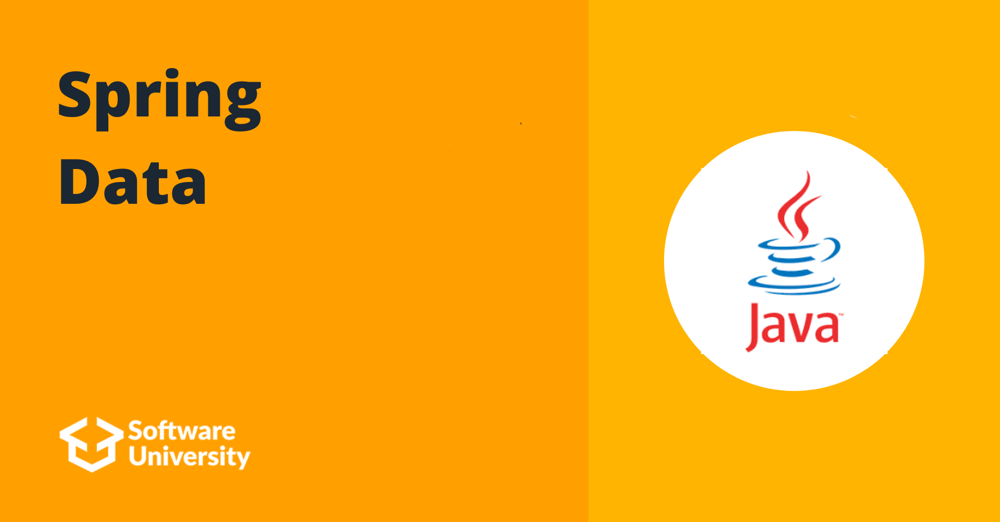

# Softuni Spring Data

## Intro
The Programming Basics was my first touch with programming. In this course I wrote my first program ("Hello World"), learned the most basic things like if-else statements, for and while loops.

To learn more about the course you can check [Softuni](https://softuni.bg/)

## Course topics
### Java DB Apps Introduction
- [Link](https://github.com/DenisBuserski/Softuni_Spring_Data/tree/main/Exercise-Java-DB-Apps-Introduction-04)
### Custom ORM
- [Link](https://github.com/DenisBuserski/Softuni-Spring-Data/tree/main/Custom-ORM)
### Introduction to Hibernate
- [Link](https://github.com/DenisBuserski/Softuni-Spring-Data/tree/main/Exercise-Introduction-To-Hibernate-08)
### Hibernate Code First

## Exams
- [Programming Basics Online Exam 6 And 7 July 2019](https://github.com/DenisBuserski/SoftUni-Programming-Basics-Java/tree/main/Programming_Basics_Online_Exam_6_And_7_July_2019)
- [Programming Basics Online Exam 6 And 7 April 2019](https://github.com/DenisBuserski/SoftUni-Programming-Basics-Java/tree/main/Programming_Basics_Online_Exam_6_And_7_April_2019)

## Certificates

